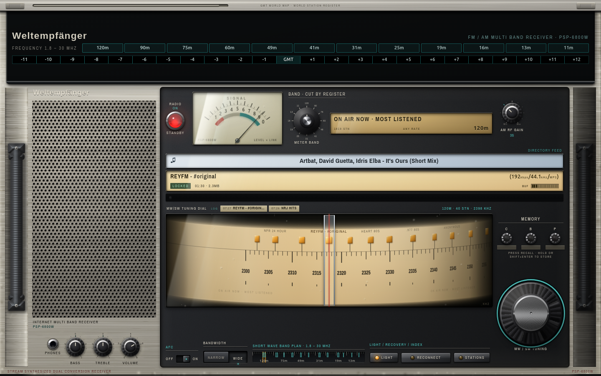
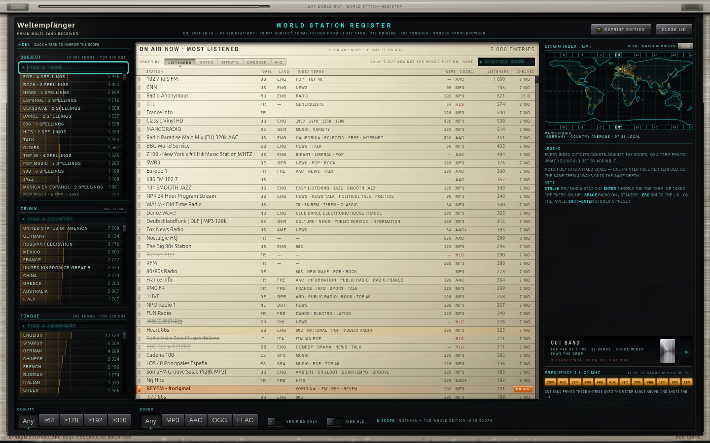

# Weltempfänger

**A desktop shortwave receiver that happens to stream internet radio.** Open the register, cut a band of stations onto the dial, then tune across them like it's 1977.



Open the register and sort, filter and audition every station



Real Icecast/SHOUTcast streams from the [Radio Browser](https://www.radio-browser.info/) open directory — 60,000+ stations

## Download

Grab a build from [**Releases**](../../releases/latest).

## Exploring the waves

The app boots in standby and the dial starts empty. Six steps, in order:

1. **Press the power dome** (`RADIO / STANDBY`, upper left of the black panel).
2. **Press `REGISTER`** (bottom right).
3. **Pick a subject** — a genre, country or language. At least one.
4. **Throw `CUT BAND`.** The matching stations print onto the meter bands as blips
5. **Turn the tuning knob** until the cursor lands on a blip. It resolves, connects and plays.
6. **Turn up `VOLUME`.**

Hold `C` / `B` / `P` for a second to store a station; a short press recalls it.

This shouldn't have to be said separately, but you need an internet connection — This is an *internet* radio, after all

## Build this yourself (why would you, but you do you!)

```bash
npm install
npm run build
npm start
```

Package it yourself:

```bash
npm run pack:linux   # AppImage + deb
npm run pack:win     # portable .exe + zip — builds on Linux, no wine needed
npm run pack:mac     # unsigned .app zips, x64 + arm64
```

Node 20 or newer (CI builds on 22).

## Licence

MIT. Bundled font is [Archivo Narrow](https://github.com/Omnibus-Type/ArchivoNarrow) by Omnibus-Type, [SIL Open Font License 1.1](src/renderer/assets/fonts/OFL.txt).
